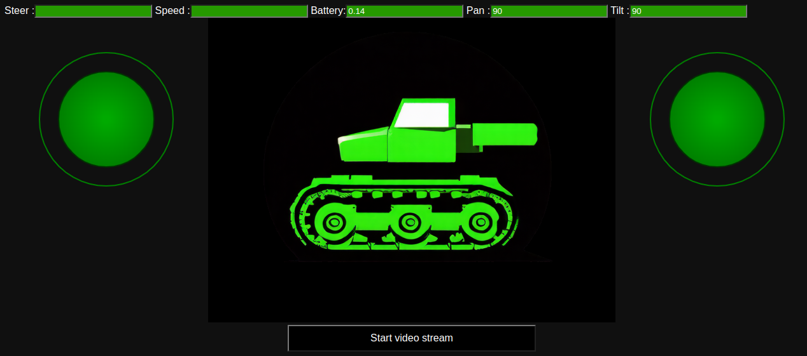

# Tankie
Remote Controlled Tank for AI integration
<br>
<br>
<br>


## Description
Tankie is a DFRobot Devastator Tank platform controlled by a ESP8266 micro controller and a SparkFun Dual TB6612FNG Motor Driver. It can be connected to an existing WiFi network or provide an access point to connect to. Remote control works via websocket. Additionally a pan/tilt bracket kit with two servos is installed on top, which can be used to attach a camera and move that around. 

This repository only contains the motor and pan/tilt control, no video or audio input. For this an additional raspberry pi zero2 with a camera needs to be installed, the configuration of that will be put in a different repository.

## Parts
1x [DFRobot Devastator](https://www.berrybase.de/dfrobot-devastator-tank-mobile-roboterplattform)<br>
1x [D1 Mini - ESP8266 Micro Controller](https://www.berrybase.de/en/detail/019234a3e5a1705e9e602f2dd7ea7f72)<br>
1x [SparkFun Motor Driver - Dual TB6612FNG](https://www.sparkfun.com/sparkfun-motor-driver-dual-tb6612fng-1a.html)<br>
1x [USB DC Buck Step Down Converter 6-24V 12V/24V To 5V 3A](https://www.diymore.cc/products/usb-dc-buck-step-down-converter-6-24v-12v-24v-to-5v-3a-car-charger-module)<br>
1x [Pan/Tilt Bracket Kit](https://www.robotshop.com/products/pan-tilt-bracket-kit-single-attachment)<br>
2x [G90 Micro Servo 5V Plastic Motor](https://eckstein-shop.de/WaveShare-SG90-Micro-Servo-5V-Plastic-Motor-180Grad-EN)<br>
1x [Breadboard](https://www.berrybase.de/en/detail/019234a3c572735085405d3bf4e22c71) or 1x [breadboard, double-sided, 70 x 50 mm](https://www.reichelt.com/de/en/shop/product/breadboard_double-sided_70_x_50_mm-319111?&LANGUAGE=en)<br>

## Hardware Setup

## Software Requirments
This project is currently built with ArduinoIDE, but eventually will be switched to PlatformIO. To build the firmware, you will need to install aditional arduino libraries listed below.

### Tools
- [ArduinoIDE 2.2.1 or newer](https://www.arduino.cc/en/software/)
- [Arduino core for ESP8266 WiFi chip](https://github.com/esp8266/Arduino)
- [LittleFS uploader plugin for Arduno 2.2.1 and higher](https://github.com/earlephilhower/arduino-littlefs-upload)

### Libraries
To be installed within the ArduinoIDE
- AsyncTCP
- ESPAsyncTCP
- ESPAsyncWebServer
- ElegantOTA

## Firmware
- Pinout and other config setting can be set in the [config.h](tankie/config.h) file.

### Configure as WiFi Client
Set **AP_MODE** to **false**:
```
#define AP_MODE false
```

Enter your wifi credentials:
```
#define STASSID "your access point ssid"
#define STAPSK "your wifi password"
```

### Configure as Access Point 
Set **AP_MODE** to **true**:
```
#define AP_MODE true
```

Set the Access Point name and password:
```
#define STASSID "your access point ssid"
#define STAPSK "your wifi password"
```

### Upload via USB
The first upload has to happen via usb and can be done as usual with the Arduino IDE
- select Wemos D1 Mini as board
- select the usb board it is connected to
- click on upload

### Upload via ElegantOTG
The firmware makes use of [ElegantOTG](https://github.com/ayushsharma82/ElegantOTA), which allows to update firmware and littlefs data via the browser over Wifi. This can be used after installing the firmwar once vi usb.

In the ArduinoIDE, select __Sketch->Export Compiled Binary__. The exported .bin file will end up in the [build](tankie/build) folder. Upload it through the ElegantOTA web ui available at __http://<ip-of-tankie>/update__.

## Data
Additional to the firmware, files from the [data folder](tankie/data/) have to be uploaded as littlefs filesystem.

### Upload via USB
- Install the [LittleFS uploader plugin for Arduno 2.2.1 and higher](https://github.com/earlephilhower/arduino-littlefs-upload)
- In the ArduinoIDE press __[Shift]__+__[Control]__+__[p]__. A menu will appear, enter __littlefs__ and click __Upload LittleFS to Pico/ESP...__
- It will create the littlefs .bin file and upload it

### Upload via ElegantOTG 
Follow the instructions for the usb data upload. It will fail if not connected via usb, but create the data .bin file in the **/tmp** directory. To find the exact name, look at the consle output of the tool in the arduinoIDE. You can simply copy that file from /tmp and upload it via the ElegantOTG UI. 

## RC Usage
Connect to __http://<ip_of_tankie>__ adress with a browser. You should see a control interface with two joysticks and some fields that diaplsy current drive, steer, pan and tilt values as well as the current voltage of the power supply.
<br>
<br>
<br>


## AI Usage
Still WIP

## Projects used
- [joy.js](https://github.com/bobboteck/JoyStick)
- [SparkFun TB6612 library](https://github.com/sparkfun/SparkFun_TB6612FNG_Arduino_Library)
