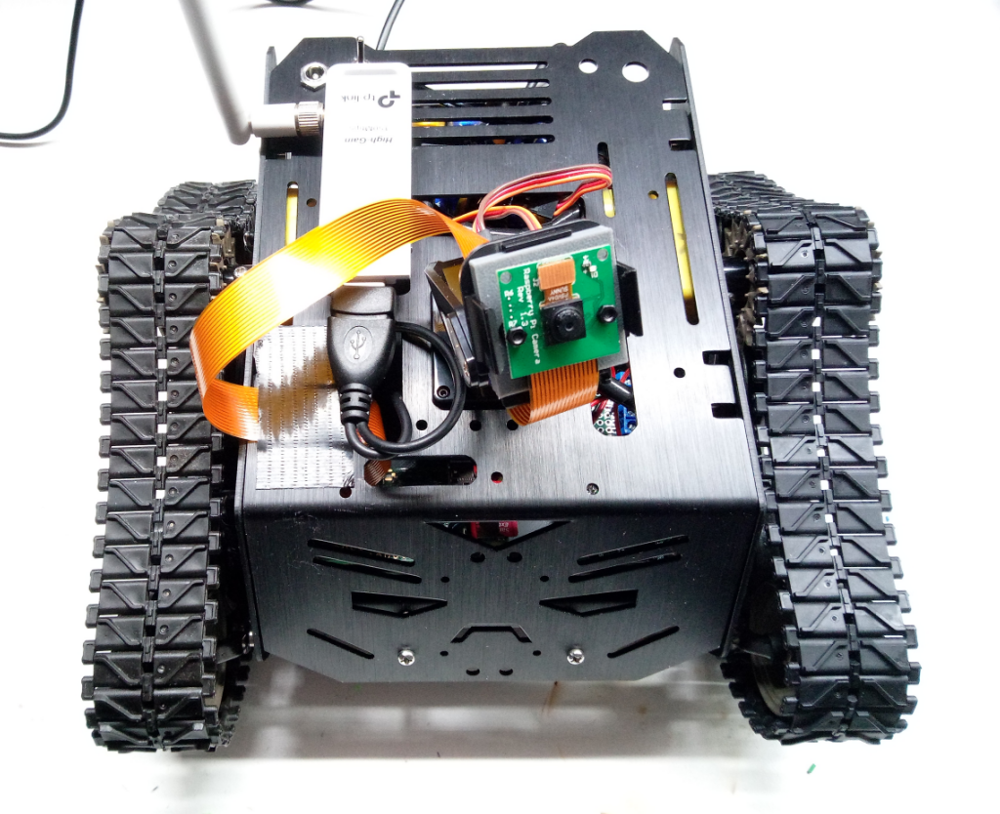
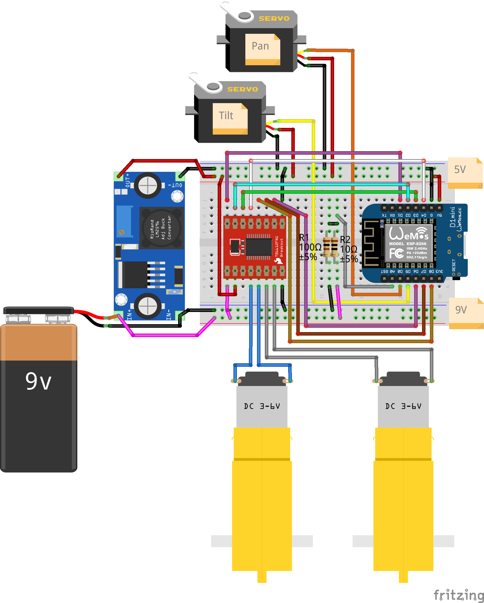
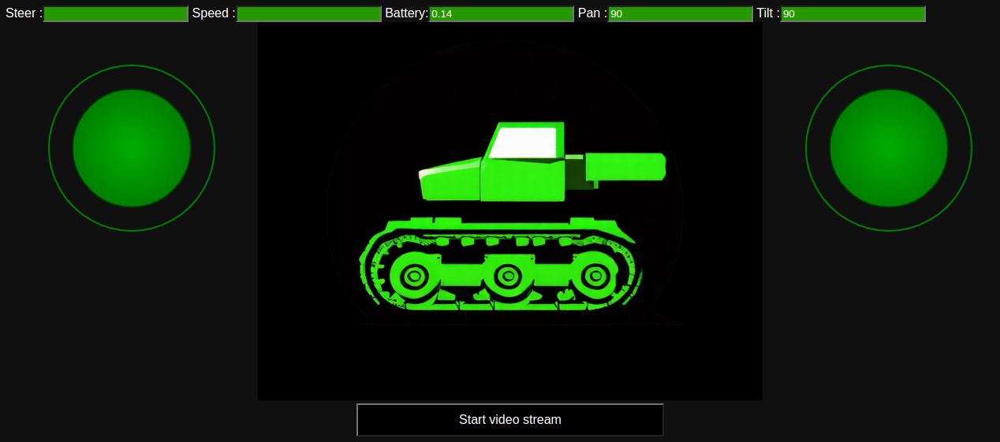

# Tankie
Remote Controlled Tank for AI integration
<br>
<br>
<br>


## Description
Tankie is a DFRobot Devastator Tank platform controlled by a ESP8266 micro controller and a SparkFun Dual TB6612FNG Motor Driver. It can be connected to an existing WiFi network or provide an access point to connect to. Remote control works via websocket. Additionally a pan/tilt bracket kit with two servos is installed on top, which can be used to attach a camera and move that around. 

This repository contains the motor and pan/tilt control (ESP8266) as well as the video input. For video, an additional Raspberry Pi Zero 2 W with a camera is installed on top of the tank; its setup (mediamtx streaming) lives in the [raspberry_pi/](raspberry_pi/) directory. Audio input is still being worked out (see the issues).

## Parts
1x [DFRobot Devastator](https://www.berrybase.de/dfrobot-devastator-tank-mobile-roboterplattform)<br>
1x [D1 Mini - ESP8266 Micro Controller](https://www.berrybase.de/en/detail/019234a3e5a1705e9e602f2dd7ea7f72)<br>
1x [SparkFun Motor Driver - Dual TB6612FNG](https://www.sparkfun.com/sparkfun-motor-driver-dual-tb6612fng-1a.html)<br>
1x [USB DC Buck Step Down Converter 6-24V 12V/24V To 5V 3A](https://www.diymore.cc/products/usb-dc-buck-step-down-converter-6-24v-12v-24v-to-5v-3a-car-charger-module)<br>
1x [Pan/Tilt Bracket Kit](https://www.robotshop.com/products/pan-tilt-bracket-kit-single-attachment)<br>
2x [G90 Micro Servo 5V Plastic Motor](https://eckstein-shop.de/WaveShare-SG90-Micro-Servo-5V-Plastic-Motor-180Grad-EN)<br>
1x [Breadboard](https://www.berrybase.de/en/detail/019234a3c572735085405d3bf4e22c71) or 1x [breadboard, double-sided, 70 x 50 mm](https://www.reichelt.com/de/en/shop/product/breadboard_double-sided_70_x_50_mm-319111?&LANGUAGE=en)<br>

## Hardware Setup

**Please note:** The DC-DC converter and 9V power source in the image are wrong, a 9V battery won't be sufficient to power Tankie, use instead the 6x 1.5V battery box that comes with the Devastator Kit. The DC-DC converter in the image can be used, however, it requires to have the output value adjusted manually, I'd suggest to use the converter in the parts list instead.

## Software Requirements

The ESP8266 firmware (in [`tankie/`](tankie/)) can be built with **any** of the
three toolchains below. They all target the same board — **Wemos D1 Mini**
(`esp8266:esp8266:d1_mini`, ESP8266 core 3.1.2) — and produce a compatible
firmware + LittleFS data partition. The only thing that differs between them
is how the `ELEGANTOTA_USE_ASYNC_WEBSERVER=1` build flag and the dependencies
are declared (see each method's notes).

### 1. PlatformIO (recommended for local dev)

Install [PlatformIO](https://platformio.org/): `pip install platformio`

The config lives at the repo root in [`platformio.ini`](platformio.ini).
Build, upload, and monitor from the CLI:
```
pio run                 # firmware
pio run -t buildfs      # LittleFS data partition (tankie/data/)
pio run -t upload       # flash firmware (USB, once / reflashable boards)
pio run -t uploadfs     # flash the LittleFS data partition
```
`platformio.ini` pins the board, the LittleFS layout
(`board_build.ldscript = eagle.flash.4m2m.ld`, matching the 4M/FS:2MB
`2072576`-byte image), the `ELEGANTOTA_USE_ASYNC_WEBSERVER=1` flag, and the
library dependencies. No file moves are needed — `src_dir`/`data_dir` point at
the existing `tankie/` and `tankie/data/`.

### 2. arduino-cli (used on the tank Pi)

The Pi build script (`raspberry_pi/build.sh`) uses `arduino-cli` and produces
the exact image the firmware + LittleFS partition expect:
```
bash raspberry_pi/build.sh
```
For a one-off manual compile:
```
arduino-cli compile --fqbn esp8266:esp8266:d1_mini \
  --build-property "compiler.cpp.extra_flags=-DELEGANTOTA_USE_ASYNC_WEBSERVER=1" \
  tankie
```
`sketch.yaml` (in [`tankie/`](tankie/)) pins the FQBN, the esp8266 core
(3.1.2), and every external library version, so the build is reproducible
without relying on a personal IDE state.

### 3. Arduino IDE

- Install [Arduino IDE 2.2.1 or newer](https://www.arduino.cc/en/software/)
  and the [Arduino core for ESP8266](https://github.com/esp8266/Arduino).
- Open `tankie/` as a project. Install the libraries from
  [`tankie/libraries.json`](tankie/libraries.json) (or add them via *Sketch →
  Include Library → Manage Libraries*):
  - ElegantOTA 4.0.0
  - ESPAsyncWebServer 3.1.0
  - ESPAsyncTCP 1.2.4
  - AsyncTCP 1.1.4
  - Servo 1.3.0
- Select **Wemos D1 Mini** as the board.
- **Build note:** the sketch uses the async web stack, so ElegantOTA must be
  compiled in async mode — add `ELEGANTOTA_USE_ASYNC_WEBSERVER=1` to
  *File → Preferences → Additional compiler flags* (or the board's custom
  flags). The same flag is applied automatically by the PlatformIO and
  arduino-cli methods above.

### Libraries (reference)

| Library | Version |
|---|---|
| [ElegantOTA](https://github.com/ayushsharma82/ElegantOTA) | 4.0.0 |
| [ESPAsyncWebServer](https://github.com/me-no-dev/ESPAsyncWebServer) | 3.1.0 |
| [ESPAsyncTCP](https://github.com/me-no-dev/ESPAsyncTCP) | 1.2.4 |
| [AsyncTCP](https://github.com/me-no-dev/AsyncTCP) | 1.1.4 |
| [Servo](https://github.com/arduino/arduino-libraries) | 1.3.0 |

The ESP8266 core also bundles its own interrupt-driven Servo, so the
`Servo.h` used by the sketch is the core's (the generic arduino-libraries
Servo is for the arduino-cli path).
## Firmware
- Pinout and other config setting can be set in the [config.h](tankie/config.h) file.

### WiFi configuration (WiFiManager)
The firmware no longer hard-codes WiFi credentials or an `AP_MODE` switch.
Instead it uses a small [WiFiManager](tankie/wifimanager.h) class (implemented
on top of the already-running `ESPAsyncWebServer`, so it does not clash with
`ElegantOTA` / `ESPAsyncWebServer` the way the `WiFiManager` library does).

On boot the ESP:
1. reads the saved network from the **reserved EEPROM flash sector
   `0x3FB000`** (a dedicated 4 KB sector, see below) and tries to connect in
   **STA mode**;
2. if that fails (or nothing is saved yet) it opens its own access point
   `tankie-esp` (password `tankie1234`) and serves the **setup web page** at
   `http://192.168.4.1:8080` where you can enter the SSID / password / static
   IP / gateway. Saving writes the EEPROM sector and reboots the ESP, retrying
   step 1.

   The setup form runs on a dedicated config server (port **8080**); port 80
   always serves the tank control page, even in config mode (it shows a hint
   pointing at the portal URL).

The AP name + password are set in [config.h](tankie/config.h):
```
#define APSSID "tankie-esp"
#define APPSK  "tankie1234"
```

**Where the network config lives (issue #54):** the saved network is stored in
the reserved **EEPROM flash sector `0x3FB000`** (4 KB), *not* on LittleFS.
That sector is outside both the firmware region (`0x0`) and the LittleFS data
partition (`0x200000`), so the config **survives both firmware OTA and
filesystem/data-partition OTA** — a failed or corrupt fs-OTA no longer wipes
the WiFi credentials and strands the ESP on the `tankie-esp` config portal.
The blob is a small length-prefixed structure (magic + version +
ssid/pass/ip/gateway + a trailing CRC32) managed by
[`wificfg.h`](tankie/wificfg.h) / [`wificfg.cpp`](tankie/wificfg.cpp); a blank
or corrupt sector is detected via the magic + CRC and cleanly falls back to the
config portal. See
[issue #54](https://github.com/a-i-a-d/Tankie/issues/54) for the background,
and issue [#21](https://github.com/a-i-a-d/Tankie/issues/21) for why the
`WiFiManager` library was replaced.

### Upload via USB
The first upload has to happen via USB and can be done as usual with the Arduino IDE
- select Wemos D1 Mini as board
- select the USB board it is connected to
- click on upload

### Upload via ElegantOTA
The firmware makes use of [ElegantOTA](https://github.com/ayushsharma82/ElegantOTA), which allows to update firmware and littlefs data via the browser over Wifi. This can be used after installing the firmware once via USB.

In the Arduino IDE, select __Sketch->Export Compiled Binary__. The exported .bin file will end up in the [build](tankie/build) folder. Upload it through the ElegantOTA web ui available at __http://<ip_of_tankie>/update__.

## Data
Additional to the firmware, files from the [data folder](tankie/data/) have to be uploaded as littlefs filesystem.


### Upload via USB
- Install the [LittleFS uploader plugin for Arduino 2.2.1 and higher](https://github.com/earlephilhower/arduino-littlefs-upload)
- In the Arduino IDE press __[Shift]__+__[Control]__+__[p]__. A menu will appear, enter __littlefs__ and click __Upload LittleFS to Pico/ESP...__
- It will create the littlefs .bin file and upload it

### Upload via ElegantOTA 
Follow the instructions for the USB data upload. It will fail if not connected via USB, but create the data .bin file in the **/tmp** directory. To find the exact name, look at the console output of the tool in the arduinoIDE. You can simply copy that file from /tmp and upload it via the ElegantOTA UI. 

## RC Usage
Connect to __http://<ip_of_tankie>__ address with a browser. You should see a control interface with two joysticks and fields that display steer, speed, pan and tilt values as well as the current voltage of the power supply.
<br>
<br>
<br>


## AI Usage
The [ai-control](ai-control/) folder contains the code that connects an AI to the tank (see [ai-control/README.md](ai-control/README.md)).

### Safety & state feedback
- **Safety watchdog (firmware):** if the tank is driving and no command is received for 5 seconds, the motors are stopped and the pan/tilt camera is recentered automatically. A watchdog event is broadcast to all websocket clients as `{"type":"watchdog"}` (issue #32).
- **State feedback:** the periodic websocket broadcast includes the current state in addition to the battery voltage, in the contract shape: `{"type":"state","seq":N,"battery":...,"speed":...,"steer":...,"pan":...,"tilt":...,"net_mode":"sta"|"ap","net_ip":"192.168.x.y","stream_url":"http://192.168.1.42:8889/cam/"}` (issue #32, #46, #51). The `net_mode` and `net_ip` fields let a client determine the ESP's IP address and WiFi mode (STA vs AP) without needing the boot console (issue #46). The `stream_url` field (issue #51) carries the Pi's own video-stream endpoint, pushed by the bridge via the `set_stream` command — the human web UI only shows the "Start video stream" button once a `stream_url` has been seen, so the iframe always points at the Pi's current (dynamic) IP.
- **JSON protocol (ai_control.py):** the LocalAI client speaks the JSON protocol contract — `{"cmd":"pan","angle":N}` / `{"cmd":"tilt","angle":N}` for the camera and one combined `{"cmd":"drive","speed":N,"steer":M}` object for the drive (the legacy `key=value` dialect was retired by #32, issue #38).
- **Continuous control (ai_control.py):** a background control loop re-issues the active drive command (the combined `drive` object) every second so the firmware watchdog stays armed while the AI is thinking between frames.
- **Autonomous drive profile:** AI-issued drive commands are clamped to `max_speed = 40` (see `AUTO_PROFILE` in `ai_control/LocalAI/ai_control.py`), slower than the manual joystick range, so a misbehaving model cannot drive the tank at full speed.
- **Pan/tilt:** the firmware clamps `pan`/`tilt` values to the 0-180 servo range; the AI tools already use relative moves (`up`/`down`/`left`/`right`/`center`) around the 90-degree center position.
### Configuration (issue #16)
No network endpoints are hard-coded in the AI code:

- **`ai-control/LocalAI/ai_control.py`** (LocalAI client) — one config source: env vars >
  optional `ai_control.json` (next to the script) > built-in defaults.
  | env var | json key | default | meaning |
  |---|---|---|---|
  | `LOCALAI_API_URL` | `api_base` | `http://localai.local:8080/v1` | LocalAI base URL (OpenAI-compatible) |
  | `LOCALAI_API_KEY` | `api_key` | `sk-0123456789` | LocalAI accepts any key or none |
  | `TANKIE_VIDEO_URL` | `video_url` | `rtsp://tankie_pi.local:8554/cam_low` | camera stream for OpenCV (fallbacks in the script) |
- **`raspberry_pi/serial_bridge/`** (Pi bridge) — `TANKIE_BRIDGE_SOCK` / `TANKIE_STATE_FILE`
  (section below); it pushes the Pi's own `stream_url` to the ESP (issue #51).
- **`tankie/data/`** (web UI) — stream URL is never hard-coded: the `stream_url`
  field in every `state` broadcast (see above), pushed by the bridge.
- **`ai-control/tankieControl`** — LocalAGI path, parked (mudler/LocalAGI#340);
  removed in a later cleanup step.

## Serial control protocol (ESP8266 over the Pi native UART0)
The ESP8266 is controlled over the Pi's native UART0 (`/dev/ttyS0` @ 921600 8N1, wired TX→RX / RX→TX / GND→GND — the permanent control link; `/dev/ttyUSB0` is only the USB flashing adapter)
using a line-oriented JSON protocol (NDJSON) — see
[issue #29](https://github.com/a-i-a-d/Tankie/issues/29). The WiFi/WebUI
path above stays available as a fallback.

Pi → ESP (commands):

```json
{"cmd":"drive","speed":50,"steer":0}
{"cmd":"pan","angle":90}
{"cmd":"tilt","angle":30}
{"cmd":"pan-rel","delta":+20}
{"cmd":"tilt-rel","delta":-10}
{"cmd":"center"}
{"cmd":"sweep","axis":"pan","from":0,"to":180,"steps":20}
{"cmd":"stop"}
{"cmd":"set_stream","ip":"192.168.1.42","port":8889,"path":"/cam/"}
{"cmd":"set_wifi","ssid":"tankie-lan","pass":"hunter2","ip":"192.168.178.126","gateway":"192.168.178.1"}
{"cmd":"set_wifi","reset":true}
{"cmd":"get_wifi"}
{"cmd":"reboot"}
```

ESP → Pi (responses):

```json
{"type":"hello","proto":1,"fw":"v0.1-serial"}
{"type":"ack","seq":1}
{"type":"error","seq":2,"code":"range","field":"speed"}
{"type":"watchdog"}
{"type":"sweep","axis":"pan","done":true}
{"type":"state","seq":1,"battery":7.42,"speed":50,"steer":0,"pan":90,"tilt":90,"net_mode":"sta","net_ip":"192.168.1.42","stream_url":"http://192.168.1.42:8889/cam/"}
{"type":"wifi","ssid":"tankie-lan","mode":"sta","ip":"192.168.178.126"}
```

`set_stream` (issue #51) lets the Pi — the only component that knows its own
(dynamic) IP — push its video-stream endpoint to the ESP. The ESP stores it
and appends it as `stream_url` to every `state` broadcast; the human web UI
then points its video iframe at that URL instead of a hard-coded address. The
field is omitted until the Pi has sent one, so the line shape is unchanged for
pairs that do not use it.

`set_wifi` / `get_wifi` / `reboot` (issue #56) let the Pi — or a Pi-only agent —
re-network and restart the tank over the serial link without a browser. `set_wifi`
stores the WiFi config (ssid / pass / optional static ip + gateway, or `reset:true`
to wipe it) in the **same reserved EEPROM sector `0x3FB000`** the config portal
uses (issue #54) and reboots to apply — the exact same path, so the web and serial
config paths behave identically. `get_wifi` echoes the current `ssid` / `mode` /
`ip` (no password). `reboot` restarts the ESP on demand (so an agent with only
serial access can reboot the tank without power-cycling). All three are additive —
protocol version stays 1.

The ESP keeps that endpoint only in RAM, so an ESP reboot loses it. The bridge
therefore self-heals (issue #57): it tracks whether the ESP currently holds a
`stream_url` (from the ESP's own `state` broadcasts) and, on its 30 s stream
tick, force-pushes `set_stream` once whenever the Pi has a LAN IP but the ESP
reports no `stream_url`; the push stops as soon as the ESP confirms the URL, so
it never spams. This restores the "Start video stream" button within ~30 s of an
ESP reboot even if the `hello` handshake is missed (e.g. when boot noise and the
`hello` land on the same serial line — the reader now extracts the first
parseable JSON object instead of requiring the line to start with `{`).

Rules: strict validation + clamping on the ESP (speed/steer ±255, pan/tilt
0–180, relative deltas ±180); a command watchdog stops the motors if the
link goes quiet (`SERIAL_WATCHDOG_MS`, compile-time in `tankie/config_serial.h`);
seq-based acks so a dead link is detectable; a hello/proto handshake
catches firmware/Pi mismatches. Non-JSON lines (debug output) are ignored.

The pan/tilt improvements (issue #31) are additive — protocol version stays 1:
- `pan-rel` / `tilt-rel` move the servo by a delta from the current angle
  (clamped to 0–180).
- `center` sets pan=90 **and** tilt=90 in one ack.
- `sweep` steps the camera across a range non-blockingly (~2 s default,
  `steps` 1–50) and emits `{"type":"sweep","axis":...,"done":true}` on
  completion; `stop` (or an explicit pan/tilt) cancels it.

The **autonomous drive profile** (issue #31) is enforced in the bridge
(`raspberry_pi/conf/serial_bridge.yaml` → `auto_profile`): AI-issued `drive`
commands are clamped to `max_speed`/`max_steer` before they reach the ESP,
and the 250 ms keep-alive re-sends the clamped values. Manual (CLI / Web UI)
traffic is not clamped.

### Pi-side bridge (`raspberry_pi/serial_bridge/`)

- `bridge.py` — daemon holding the control link (`/dev/ttyS0` by default): reader thread (NDJSON in,
  seq/ack tracking, link health), writer thread (250 ms keep-alive
  re-send of the active drive command), state store
  (`/var/lib/tankie/state.json`), Unix socket (`/run/tankie/bridge.sock`).
  Installed by `setup.sh` to `/usr/local/lib/tankie/bridge.py`.
- `tankie-serial.py` — CLI: `drive --speed 50 --steer 0`, `pan 90`, `tilt 30`,
  `pan-rel 20`, `tilt-rel -10`, `center`, `sweep --axis pan --from 0 --to 180
  [--steps 20]`, `stop`, `state`, `watchdog-test`, `wifi --ssid tankie-lan
  --pass hunter2 [--ip 192.168.178.126 --gateway 192.168.178.1]` / `wifi
  --reset` / `wifi` (query), `reboot` (issue #56) (or `--raw` to talk to the
  port directly). Installed by `setup.sh` as `tankie-serial` in
  `/usr/local/bin`.
- `conf/serial_bridge.yaml` — single config source (serial_port, baud,
  keepalive_ms, ack_timeout_ms, state_file, socket_path, stream_port,
  stream_path). Installed by `setup.sh` to `/etc/tankie/serial_bridge.yaml`;
  `--config` wins, then the installed system config, then the checkout-relative
  `conf/` (dev execution).
- `tankie-serial.service` — systemd unit (`Restart=always`, dialout group),
  installed by `setup.sh` to `/etc/systemd/system`. References only installed
  system paths (issue #53).
- `setup-serial.sh` — idempotent installer (deps, udev rule, systemd). Invoked
  by `setup.sh`; also runnable standalone for just the serial bridge.
- `test_serial_proto.py` — raw-port protocol test (T1–T10 of the issue, incl.
  the pan-rel / tilt-rel / center / sweep commands from issue #31).

```sh
sudo bash raspberry_pi/setup.sh                          # install everything (incl. serial bridge)
tankie-serial drive --speed 50 --steer 0
tankie-serial state

## Testing
The ESP8266 firmware logic is covered by a host-side unit-test suite (no ESP
toolchain needed) in [tests/](tests/), plus a CI compile-check for the full
sketch in [.github/workflows/tests.yml](.github/workflows/tests.yml):

- `tests/test_wheels.cpp` - the pure drive-math `computeWheels()`
  ([tankie/wheels.cpp](tankie/wheels.cpp), no Arduino deps): straight /
  turn-left / turn-right in fwd + rev, spin-in-place at `speed == 0`,
  the clamped +/-255 extreme corners (issue #14), and an exhaustive
  (speed, steer) matrix check that both outputs stay within [-255, 255]
- `tests/test_tankdrive.cpp` - `TankDrive` end-to-end through the real
  `Motor` H-bridge: the full branch matrix (stop / spin-in-place / fw / bw
  x straight / left / right, partial steer, boundary values), asserting
  the real `config.h` H-bridge pins (PWM + In1/In2 direction)
- `tests/test_motor.cpp` - `Motor::drive/brake/standby` and the
  `forward/back/left/right/brake` free functions
- `tests/test_bat_voltage.cpp` - the battery voltage-divider math
  (`getBatVoltage()`, extracted from `tankie.ino` into [tankie/batt.cpp](tankie/batt.cpp))
- `tests/test_wifimanager.cpp` - the WiFi config blob codec + EEPROM
  adapter ([tankie/wificfg.cpp](tankie/wificfg.cpp), issue #54):
  encode/decode round-trip, the CRC32 (known IEEE vector), and the
  blank-sector / corrupt-byte / bad-magic / wrong-version / oversized-field
  / truncated-blob rejection paths, plus the EEPROM save→load, wipe, and
  "survives an fs-OTA wipe" round-trips

- `tests/test_set_wifi.cpp` - the `set_wifi` / `get_wifi` / `reboot` serial
  commands (issue #56) against the REAL codec + EEPROM shim: a save lands
  the config in the EEPROM sector (read back via `wifiCfgLoad`) and sets
  the reboot-pending flag, `reset:true` wipes the sector, malformed input
  (missing/empty ssid, oversized ssid/pass, bad ip/gateway) is rejected
  with no save, a full-cap (64-char ssid+pass) line is not truncated
  (`lineBuf_` 128→256), and `get_wifi` returns ssid/mode/ip (no password)
- `tests/test_ws_fallback.cpp` - the WebSocket fallback handler
  (`handleWebSocketMessage()` in [tankie/tankie.ino](tankie/tankie.ino))
  compiled against the network shims in [tests/shims/](tests/shims/):
  valid drive/pan/tilt/stop move the motors/servos, out-of-range /
  missing-field / non-JSON / unknown-cmd messages are rejected (no motor
  or servo change), binary + fragmented frames are ignored, and the
  out-of-bounds `data[len] = 0` write is gone (a canary byte at
  `data[len]` is left untouched) (issue #34)
- `tests/web_ui_harness.js` - the web UI (tankie/data/script.js) in a Node
  VM sandbox: every outgoing websocket message is valid JSON and exactly
  the protocol-contract shapes (drive / pan / tilt / stop), and the
  incoming state/ack/error/watchdog/hello broadcasts are handled
  (issue #32)
- `tests/ai_control_json_harness.py` - the LocalAI client
  (ai-control/LocalAI/ai_control.py) with stubbed deps: every outgoing
  message is a contract JSON object (drive / pan / tilt / pan-rel /
  tilt-rel / center / sweep), the AUTO_PROFILE speed + steer clamp is
  applied, the control loop re-issues the combined drive object, and the
  state/watchdog broadcasts parse (issue #38, #31)
- `tests/bridge_auto_profile_harness.py` - the Pi bridge daemon
  (raspberry_pi/serial_bridge/bridge.py) with stubbed serial/yaml: the
  autonomous drive profile clamps speed/steer (and reports `clamped`),
  and the new pan-rel / tilt-rel / center / sweep commands dispatch the
  correct NDJSON line with validation (issue #31)
- `tests/bridge_stream_rearm_harness.py` - the Pi bridge daemon's stream
  re-arm (issue #57) with stubbed serial/yaml: `_extract_json` recovers a
  JSON object from a clean line, a garbage-prefixed line (the ESP boot-noise
  + `hello` that share one serial line), a no-brace line, and a stray-brace
  line; `_on_state` tracks the ESP's `stream_url` presence; and the 30 s
  re-arm tick force-pushes `set_stream` exactly once when the Pi has a LAN IP
  but the ESP reports no stream, and stops once the ESP confirms it

- `tests/bridge_wifi_harness.py` - the Pi bridge daemon's `set_wifi` /
  `get_wifi` / `reboot` dispatch (issue #56) with stubbed serial/yaml:
  each command hands the exact NDJSON line to the serial port, `set_wifi`
  without a ssid (and without `reset`) is rejected, and unknown commands
  still error
- `tests/wlan0_watchdog_harness.sh` - the Pi WiFi watchdog
  (`raspberry_pi/wlan0-watchdog.sh`) with PATH-shimmed ip/lsmod/rmmod/
  modprobe/systemctl/sleep/reboot: healthy no-op, fresh-load recovery
  (module not loaded), correct rmmod order (brcmfmac_wcc before brcmfmac),
  bounded reboot after 3 failed ticks, counter reset on recovery, corrupt
  counter sanitization, and static rmmod-order check (issue #68)
- `ai-control/tankieControl/main_test.go` - the LocalAGI wrapper's
  drive/steer/camera handlers against a stub websocket tank: contract
  JSON shapes only, steer combined with the active speed, center =
  pan 90 + tilt 90 (issue #39)

Run it locally (any machine with g++, node, go):

```sh
bash tests/run_tests.sh
node tests/web_ui_harness.js   # web UI JSON protocol (node)
python3 tests/ai_control_json_harness.py   # LocalAI client JSON protocol
python3 tests/bridge_auto_profile_harness.py   # bridge auto-profile + new commands
python3 tests/bridge_stream_rearm_harness.py   # bridge stream re-arm (issue #57)
python3 tests/bridge_wifi_harness.py   # bridge set_wifi/get_wifi/reboot (issue #56)
bash tests/wlan0_watchdog_harness.sh   # Pi WiFi watchdog recovery ladder (issue #68)
(cd ai-control/tankieControl && go test ./...)   # LocalAGI wrapper JSON protocol
```

The tests compile the real firmware `.cpp` files against a minimal Arduino
shim ([tests/shims/Arduino.h](tests/shims/Arduino.h)) and exit non-zero on
any failure. The `go-checks` and `python-checks` CI jobs enforce the
module guards on every PR (issue #19): `gofmt -l` + `go vet ./...` +
`go build ./...` + `go test ./...` inside `ai-control/tankieControl`
(the only real Go module - `ai-control/functions/` has no `go.mod`),
plus `py_compile ai-control/LocalAI/ai_control.py` and a
`pip install -r requirements.txt` smoke. The `firmware-build` CI job
additionally compiles the complete sketch with arduino-cli
(esp8266 core 3.1.2, `esp8266:esp8266:d1_mini`,
`-DELEGANTOTA_USE_ASYNC_WEBSERVER=1`) so the sketch can never break the
build/flash path used on the tank Pi.

Not covered (intentionally): the network stack itself (the shims in
[tests/shims/](tests/shims/) are compile-only stubs - no real sockets)
and hardware-in-the-loop / OTA behavior. The WebSocket *command handler*
in `tankie.ino` IS covered by `tests/test_ws_fallback.cpp` (issue #34).

## Projects used
- [joy.js](https://github.com/bobboteck/JoyStick)
- [SparkFun TB6612 library](https://github.com/sparkfun/SparkFun_TB6612FNG_Arduino_Library)
